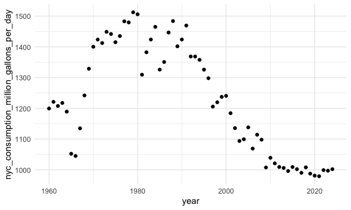

reading_data_from_the_web
================

Load key packages

``` r
library(rvest)
```

    ## 
    ## Attaching package: 'rvest'

    ## The following object is masked from 'package:readr':
    ## 
    ##     guess_encoding

``` r
library(httr)
```

## Scraping

Import NSDUH data from web

``` r
url = "https://samhda.s3-us-gov-west-1.amazonaws.com/s3fs-public/field-uploads/2k15StateFiles/NSDUHsaeShortTermCHG2015.htm"

drug_use_html = read_html(url)
```

This is an “easy” case

``` r
ndsuh_df <-
drug_use_html |> 
  html_table() |> # allows you to pull anything that is labeled as a table
  first() |> # gives first in the list
  # nth(1) gives nth number in the list
  slice(-1)
```

Slightly harder case

``` r
url = "https://www.imdb.com/list/ls070150896/"

sw_html = 
  read_html(url)
```

Now pull out elements of html that I care about.

``` r
title_vec = 
  sw_html |> 
  html_elements(".ipc-title-link-wrapper .ipc-title__text--reduced") |> 
  html_text()

metascore_vec = 
  sw_html |> 
  html_elements(".metacritic-score-box") |> 
  html_text()

runtime_vec = 
  sw_html |> 
  html_elements(".dli-title-metadata-item:nth-child(2)") |> 
  html_text()

sw_df <-
  tibble(
    title = title_vec, 
    metascore = metascore_vec, 
    runtime = runtime_vec
  )
```

## APIs

Get data using API

Get the NYC water consumption dataset

``` r
nyc_water_df <-
  GET("https://data.cityofnewyork.us/resource/ia2d-e54m.csv") |> 
  content("parsed")
```

    ## Rows: 65 Columns: 4
    ## ── Column specification ────────────────────────────────────────────────────────
    ## Delimiter: ","
    ## dbl (4): year, new_york_city_population, nyc_consumption_million_gallons_per...
    ## 
    ## ℹ Use `spec()` to retrieve the full column specification for this data.
    ## ℹ Specify the column types or set `show_col_types = FALSE` to quiet this message.

``` r
nyc_water_df |> 
  ggplot(aes(x = year, y = nyc_consumption_million_gallons_per_day)) +
  geom_point()
```



Access BRFSS

``` r
brfss_df <-
  GET("https://chronicdata.cdc.gov/api/v3/views/acme-vg9e/query.csv", 
      query = list("app_token" = "") # sometimes need to create an account or follow some extra steps to get token to access data
      ) |>  # does not work right away, need access token
  content("parsed")
```

Look at pokemon data

``` r
poke = 
  GET("https://pokeapi.co/api/v2/pokemon/1") |> 
  content()

poke[[2]]
```

    ## [1] 64
